# Local GGUF Workbench

A reproducible GGUF launcher, TurboQuant KV-cache autotuner, and benchmark runner for trying local models on Apple Silicon and Linux/NVIDIA. It builds [TheTom/llama-cpp-turboquant](https://github.com/TheTom/llama-cpp-turboquant), a llama.cpp fork.

## Quick start

Requirements: Bash, Git, CMake, curl, jq, and either Xcode command-line tools on macOS or CUDA on Linux.

```bash
scripts/preflight.sh qwen3.6-35b-a3b --allow-missing-model --allow-missing-runtime --diagnose
scripts/build.sh
scripts/download-model.sh qwen3.6-35b-a3b --resolve-only
scripts/download-model.sh qwen3.6-35b-a3b
scripts/autotune.sh qwen3.6-35b-a3b --quick
scripts/run.sh qwen3.6-35b-a3b
scripts/benchmark.sh qwen3.6-35b-a3b
scripts/stop.sh
```

Omit the model ID to use `DEFAULT_MODEL` from `config/default.env`.

## Included profiles

```text
btl-4-compact
kat-coder
kat-coder-mtp
ling3-tiny-q8
muse-glimmer
muse-glimmer-dflash
ornith-35b-i-mini
qwen36-27b-q2
qwen36-27b-q2-mtp
qwen36-27b-q2-dflash
qwen38-27b-iq3
qwen38-27b-ud-q3
qwen38-27b-ad-iq3
qwen3.6-35b-a3b
qwen3.5-27b
```

BTL-4 Compact and the Qwen3.6 27B profiles require recent upstream llama.cpp. The pinned TurboQuant fork produced slower MTP results in the earlier Qwen Q3_K_M experiment.

Add a model by copying a profile:

```bash
cp config/models/qwen3.5-27b.env config/models/my-model.env
```

At minimum set:

```bash
MODEL_NAME="My model"
MODEL_REPO="owner/gguf-repository"
MODEL_FILE="exact-file.gguf"
```

Then every command accepts `my-model` as its first argument. `MODEL_PATH` can point at an existing local GGUF instead.

## Configuration order

Later files override earlier files:

1. `config/default.env` — portable runtime defaults
2. `config/models/<id>.env` — model metadata and context targets
3. `config/runtime.env` — generated llama.cpp TurboQuant build path
4. `config/local/<id>.env` — generated machine-specific tuning winner

Models are stored under ignored `models/`. Generated runs are stored under `results/` and include the model ID.

## Benchmark output

`benchmark.sh` sends the fixed prompt in `config/prompts/benchmark.txt` to a running server and writes JSON containing the model/profile, quant file, context, hardware, memory, prompt throughput, generation throughput, speculative acceptance, and response. This is a throughput smoke benchmark, not a quality leaderboard.

`benchmark-data/short-python/` contains six deterministic coding tasks with held-out evaluators. With one model server running, use `scripts/benchmark-code.sh MODEL`; raw answers, extracted candidates, evaluator logs, and a model-tagged JSON summary are saved under `results/`. `benchmark-data/agent-51/manifest.json` pins the separate custom 20-task SWE-bench Verified, 25-task Terminal-Bench 2.1, and six-task MLE-bench evaluation subset.

## Qwen3.8 27B IQ3

[Qwen3.8 27B](https://huggingface.co/unsloth/Qwen3.8-27B-GGUF) is a dense hybrid thinking model with a native 262,144-token context window. The included `UD-IQ3_XXS` profile starts conservatively at 65,536 context with `f16/f16` KV cache and the recommended thinking defaults: temperature 1.0, top-p 0.95, top-k 20, min-p 0, zero presence penalty, xhigh reasoning, and preserved thinking.

```bash
scripts/download-model.sh qwen38-27b-iq3
scripts/run.sh qwen38-27b-iq3
scripts/benchmark.sh qwen38-27b-iq3
pi --provider local-workbench --model qwen38-27b-iq3
```

The 11,913,559,104-byte GGUF has SHA-256 `0a6129dcbbbe72f423dc67e0e3bbfbbdf3e923981a3637687ebb96a46c59d6be`.

| Context | KV cache | Prefill | Generation | Process RSS |
|---:|---|---:|---:|---:|
| 65,536 | `f16/f16` | 90.46 tok/s | **15.37 tok/s** | 15.97 GiB |

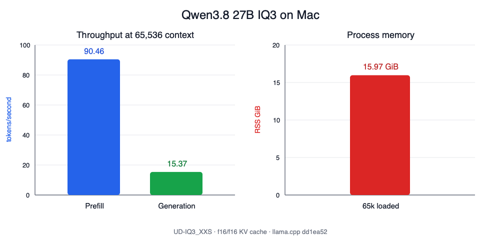

Exact chat, Pi, and structured tool-call smoke tests passed.

Reasoning effort matters substantially. Xhigh consumed 2,048 tokens without reaching a final answer on a small coding prompt; low reasoning completed it correctly. A focused low-reasoning Pi agent built a mocked single-object S3 video processor in 18.68 minutes with six tool calls, no tool errors, no compaction, and three passing independently rerun tests. Independent review accepted it with limitations: configured prefixes were not validated, successful ffmpeg exit was trusted without checking for an output file, and failure-stage cleanup coverage was incomplete.

A medium-reasoning CSV evaluation task completed in 23.53 minutes with 21 tool calls, no tool errors, 11 passing generated tests, correct fixture metrics, and four valid PNG charts. Independent review rejected it because F1 raises `ZeroDivisionError` when precision and recall are both zero; its tests and final report incorrectly claimed complete zero-denominator coverage. Machine-readable results are in `results/qwen38-27b-iq3-results.json`.

The profile uses llama.cpp's native `--reasoning on` and `--reasoning-preserve` flags. `scripts/run.sh` also forwards profile-driven min-p, presence penalty, repetition penalty, and chat-template arguments.

### Qwen3.8 Q3 comparison

The 13,441,059,904-byte Unsloth `UD-Q3_K_XL` and 13,838,267,872-byte AtomicChat `AD-IQ3_S` GGUFs were checksum-verified and compared at 65,536 context with `f16/f16` KV cache. AtomicChat's published matched-corpus measurement favors AD-IQ3_S: mean KL divergence is 0.03247 versus 0.03972, and same-top-token agreement is 92.411% versus 91.869%.

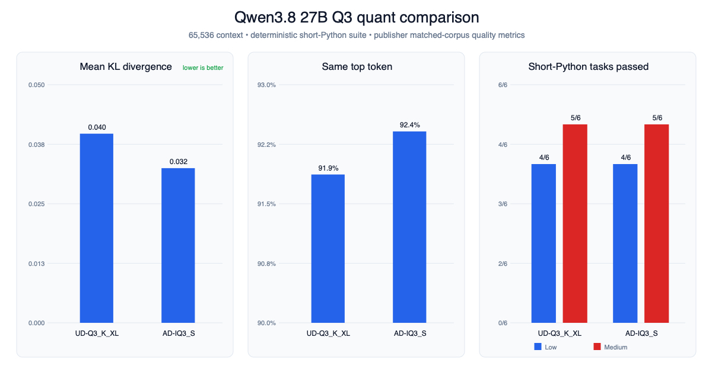

Both quants scored **4/6** on `short-python-v1` with temperature 0, seed 42, low reasoning, and a strict 1,024-token completion limit. At medium reasoning with a 2,048-token limit, both improved to **5/6** by completing binary metrics correctly. Both medium runs still exhausted the limit during dependency ordering before returning complete source. These are constrained completion results, not evidence that the truncated algorithms would be incorrect with a larger budget. Raw comparisons are in `results/qwen38-27b-short-python-comparison.json` and `results/qwen38-27b-short-python-medium-comparison.json`.

A targeted AD-IQ3_S speed matrix used one cold deterministic 512-token run per candidate at 65,536 context, with 30 seconds between candidates:

| Backend | KV cache | Speculation | Generation | RSS |
|---|---|---|---:|---:|
| Upstream | `f16/f16` | None | **15.92 tok/s** | 16.88 GiB |
| Upstream | `q8_0/q8_0` | None | 15.67 tok/s | 15.24 GiB |
| Upstream | `q4_0/q4_0` | None | 15.52 tok/s | **14.24 GiB** |
| TurboQuant | `q8_0/turbo3` | None | 15.51 tok/s | 14.59 GiB |
| TurboQuant | `q8_0/turbo4` | None | 9.40 tok/s | 14.71 GiB |
| Upstream | `f16/f16` | MTP | 12.63 tok/s | 17.94 GiB |

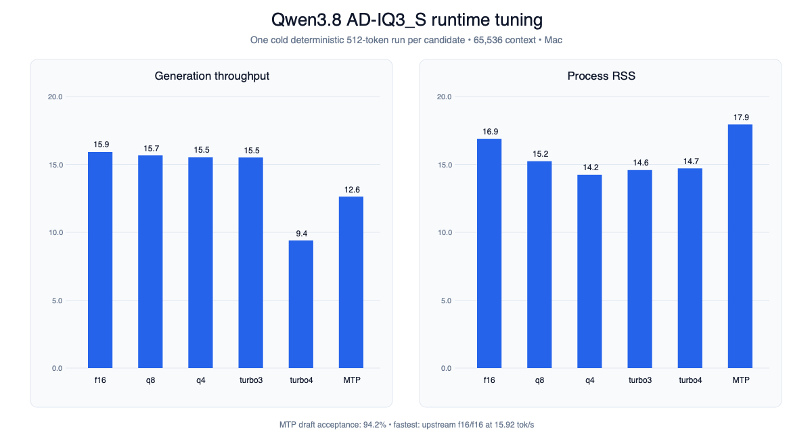

MTP was slower despite 94.2% draft acceptance. No candidate reached 20 tok/s; `f16/f16` remained fastest, while `q8_0/q8_0` saved about 1.64 GiB for a 1.6% generation penalty. The winning configuration produced 16.08 tok/s on UD-Q3_K_XL. See `results/qwen38-27b-ad-speed-matrix.json` and `results/qwen38-27b-ud-f16-confirmation.json`.

A single Terminal-Bench 2.1 `cancel-async-tasks` smoke trial gave UD-Q3_K_XL a valid 0.0 after it implemented a synchronous function instead of the required async API. The first attempt was invalid because the verifier crashed under QEMU, and the AD-IQ3_S trial was interrupted before completion. This is not a paired Terminal-Bench comparison; the preserved summary is `results/qwen38-27b-terminal-bench-smoke.json`.

## Mac results

On a Mac, the measured winner kept every MoE layer on Metal and used 10 performance-core threads, `q8_0/turbo3` KV cache, and `1024/1024` batch/ubatch.

| Configured context | Actual prompt | Prompt processing | Generation | Process RSS |
|---:|---:|---:|---:|---:|
| 65,536 | 60,504 | 372.14 tok/s | **30.91 tok/s** | 13.63 GiB |
| 98,304 | 90,751 | 229.16 tok/s | **22.80 tok/s** | 13.97 GiB |

CPU MoE offload did not help: even 8 offloaded layers reduced generation by about 16% at both contexts, while RSS stayed effectively unchanged.

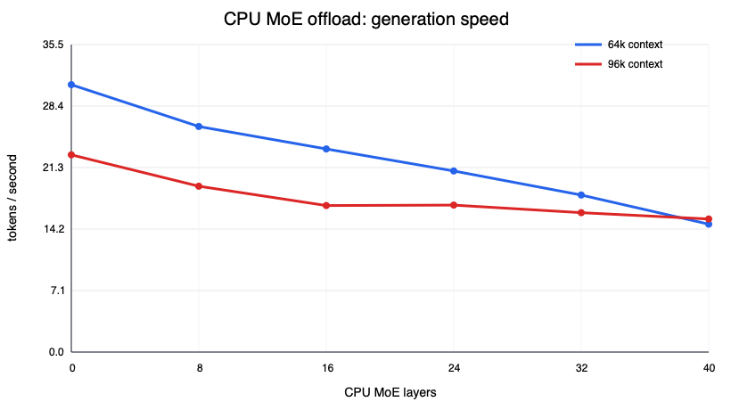

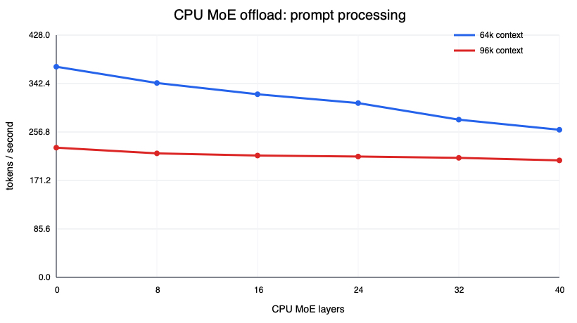

## Linux/NVIDIA reference graphs

These plots show the earlier KAT-Coder I-Mini measurements on an RTX 4050 Max-Q. The hardware and fixed configuration are included in each chart.

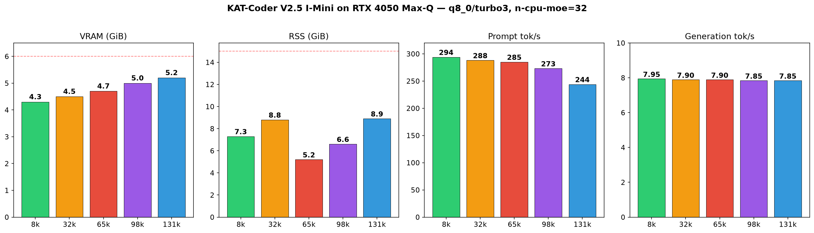

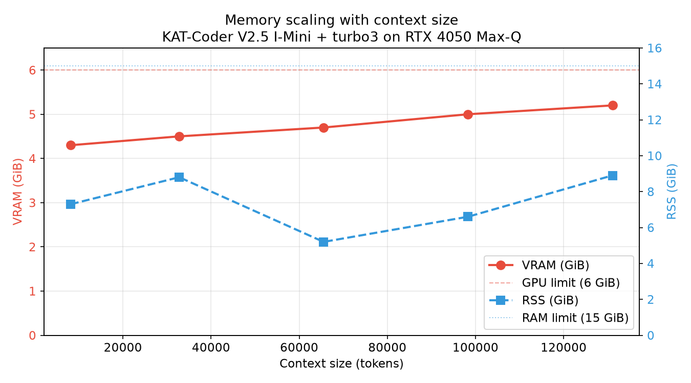

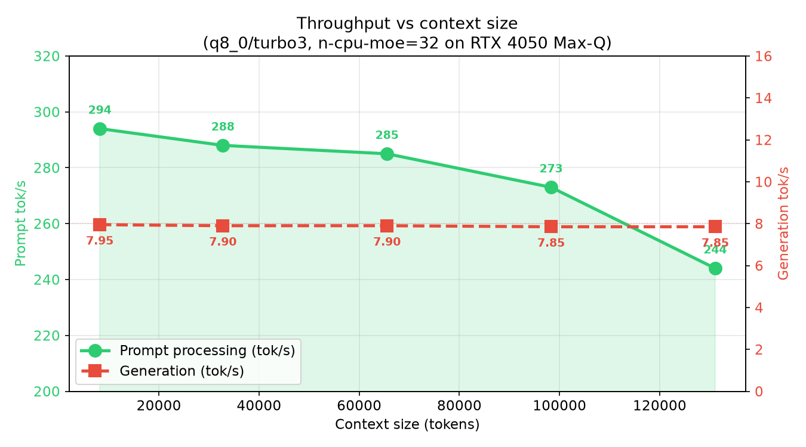

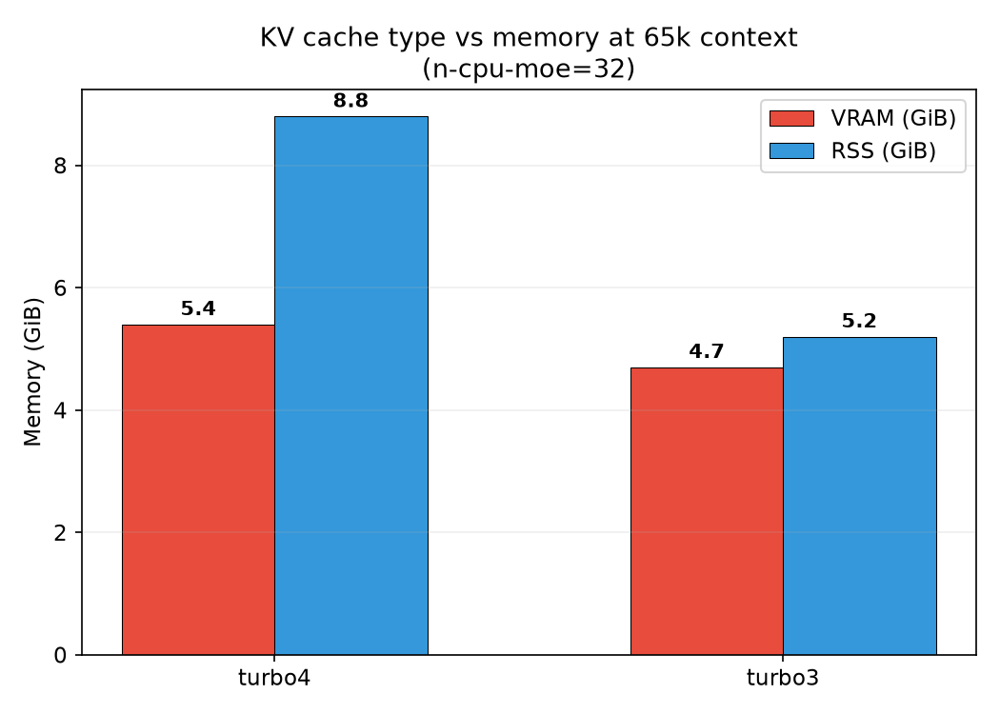

## KAT-Coder MTP benchmark

The `kat-coder-mtp` profile uses the embedded MTP head with the publisher's recommended `draft-mtp,ngram-mod` configuration. Two deterministic 512-token runs were measured at each configured context with `q8_0/turbo3`, full Metal offload, and a 38-token coding prompt.

| Context | Original | MTP + ngram | Gain | Draft acceptance |
|---:|---:|---:|---:|---:|
| 65,536 | 55.00 tok/s | **63.37 tok/s** | **15.2%** | 96.7% |
| 98,304 | 55.48 tok/s | **63.62 tok/s** | **14.7%** | 96.7% |
| 131,072 | 55.41 tok/s | **64.24 tok/s** | **15.9%** | 96.7% |

The MTP-file-only matrix produced these means:

| Context | None | ngram | MTP | MTP + ngram | Winner |
|---:|---:|---:|---:|---:|---|
| 65,536 | 56.26 | 55.84 | 61.64 | **63.37** | MTP + ngram |
| 98,304 | 64.14 | 64.40 | **69.45** | 63.62 | MTP |
| 131,072 | 64.15 | 63.38 | **64.54** | 64.24 | MTP (near tie) |

All three context sizes loaded and completed. These are short-prompt generation tests, not near-window context validation; the two-run 131k MTP result was noisy. Raw metrics and aggregates are in `results/mtp-benchmark-results.json`.

A longer 8,192-token video-preextractor prompt exposed quality failures in both models. The original hit the output limit during its tests; MTP stopped after 2,391 tokens in the middle of the implementation. Both hallucinated the PyTorchVideo API (`EncodedVideo(path)` and unsupported `get_clip` arguments instead of the documented `EncodedVideo.from_path(path)` flow). MTP was 12.7% faster, but neither response was runnable. See `results/mtp-video-preextractor-results.json`.

Sequential Pi coding-agent runs reached the same conclusion. MTP completed its tool loop 5.13x faster (5.06 versus 25.95 minutes), but both agents wrote tests around invented APIs and then reported success. Independent review found neither implementation runnable with PyTorchVideo. Workspaces and review data are under `results/pi-subagents/`.

## Qwen3.6 27B Q2 MTP benchmark

Qwen3.6 27B `UD-Q2_K_XL` baseline and MTP GGUFs were tested at 65,536 context using upstream llama.cpp commit `dd1ea524333b1e697489067d7a4c39c60d32beee`. One warm-up and two measured 512-token runs used full Metal offload, Flash Attention, one slot, and the publisher's `draft-mtp` maximum of two draft tokens.

| Mode | Generation | RSS | Draft acceptance |
|---|---:|---:|---:|
| Baseline | 10.43 tok/s | 15.95 GiB | — |
| MTP | **10.93 tok/s** | 15.61 GiB | 93.9% |

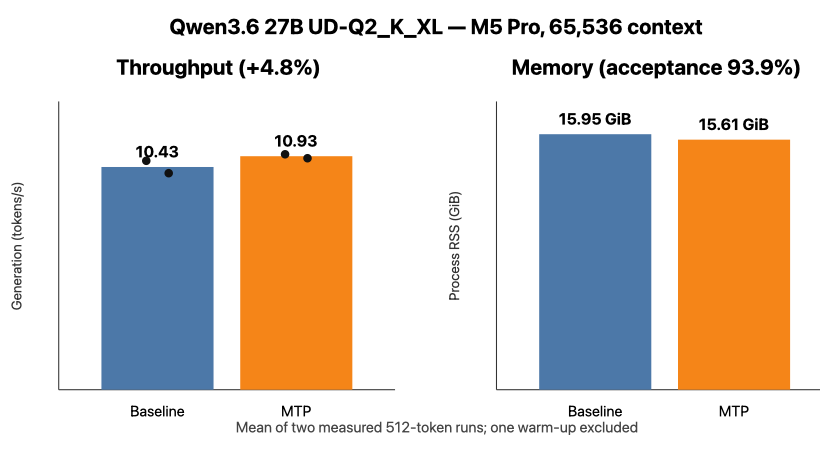

MTP improved generation by only **4.8%**, despite high acceptance, and all six deterministic responses were byte-identical. This is better than the earlier TurboQuant Q3_K_M result, where MTP was 40.7% slower, but too small to justify a coding-agent comparison yet. Raw aggregates are in `results/qwen36-27b-q2-mtp-results.json`.

A targeted 65k autotune compared three KV combinations and `1024/2048` batch and ubatch sizes. `f16/f16` with `1024/1024` won at 98.53 prompt tok/s and 9.49 generation tok/s on a 60,504-token prompt. The best `q8_0/q8_0` candidate used about 1.9 GiB less RSS but was 9.5% slower for prompt processing and 17.2% slower for generation; mixed `q8_0/f16` candidates exceeded the 900-second request timeout. See `results/qwen36-27b-q2-autotune-results.json`.

The same target was also tested with Alittlehammmer's recommended Q8_0 DFlash drafter and `--spec-draft-n-max 6`. Because sequential exploratory runs varied with system state, the reported comparison restarted each server and spaced its runs by 30 seconds.

| Mode | Generation | RSS | Draft acceptance |
|---|---:|---:|---:|
| Paired baseline | 9.54 tok/s | 15.95 GiB | — |
| DFlash Q8_0 | **10.71 tok/s** | 18.96 GiB | 91.9% |

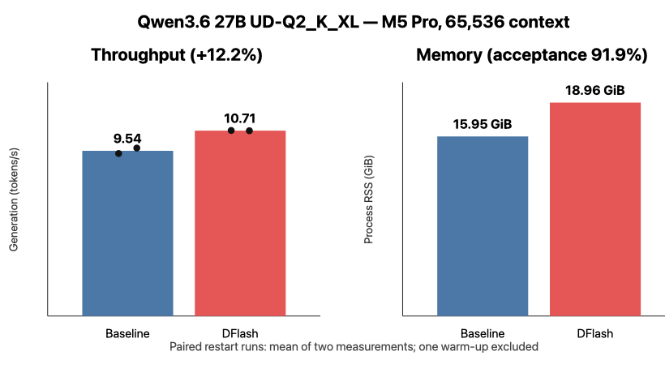

DFlash gained **12.2%** in the controlled pair and preserved byte-identical output, but added about 3.0 GiB RSS. Earlier exploratory DFlash runs ranged from 10.53 to 18.36 tok/s, so the isolated peak is not treated as sustained performance. Results are in `results/qwen36-27b-q2-dflash-results.json`.

## Muse Glimmer DFlash benchmark

Muse Glimmer 30B `UD-Q2_K_XL` was tested on the Mac at 65,536 configured context using upstream llama.cpp commit `dd1ea524333b1e697489067d7a4c39c60d32beee`. The target GGUF is 11.59 GiB; Meta's DFlash drafter adds 1.52 GiB. One warm-up and two measured 512-token runs used full Metal offload, Flash Attention, one slot, and `f16/f16` KV cache.

| Mode | Generation | RSS | Draft acceptance |
|---|---:|---:|---:|
| Baseline | 11.42 tok/s | 12.69 GiB | — |
| DFlash | **13.07 tok/s** | 14.52 GiB | 87.5% |

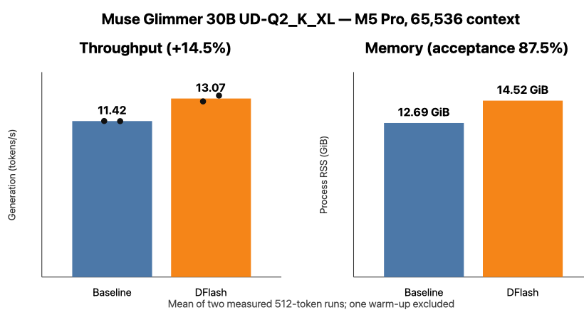

DFlash improved generation by **14.5%** and produced byte-identical deterministic responses. This is useful but much smaller than Meta's M5 Max ExecuTorch result; backend and hardware differences matter. Raw aggregates are in `results/muse-glimmer-dflash-results.json`.

An isolated Pi coding agent completed the video-preextractor task in 11.16 minutes with 13 tool calls and no tool errors. It used the documented PyTorchVideo API correctly, unlike the earlier KAT agents, but independent review still found missing worker support, filename collisions, stale overwrite manifests, and vacuous resume/corruption tests. The workspace and review are under `results/pi-subagents/muse-glimmer-dflash/`.

Muse Glimmer requires a recent upstream llama.cpp with the `muse-glimmer` architecture; the pinned TurboQuant commit does not load it. `scripts/download-model.sh muse-glimmer-dflash` resolves both the target and companion draft GGUF. The DFlash profile uses `--model-draft`, `--spec-type draft-dflash`, and `--spec-draft-n-max 15`.

## BTL-4 Compact

[BTL-4 Compact](https://huggingface.co/badtheorylabs/BTL-4-Compact) packages the 35.1B-parameter, roughly 2.1B-active MoE as a 9.3 GiB `IQ2_XXS` GGUF. It requires recent upstream llama.cpp with `qwen35moe` support. The included profile runs at 65,536 context with q8_0 K/V cache and the model card's required Jinja and DeepSeek reasoning settings:

```bash
scripts/download-model.sh btl-4-compact
scripts/run.sh btl-4-compact
pi --provider local-workbench --model btl-4-compact
```

On the Mac, a 32k smoke test generated at **71.41 tok/s**, used about **9.82 GiB RSS** after loading, returned the requested exact response, and emitted a correct OpenAI-compatible tool call. At 65k, idle RSS was about **10.16 GiB** and peak observed RSS during the coding run was about **10.54 GiB**.

The 65k direct-prompt agent completed a TypeScript project in 7.94 minutes without context compaction. Five supervised correction rounds made its mocked tests and TypeScript checks pass, but independent review still rejected the production path: face detection and ffmpeg trimming remained placeholders, command execution used a shell, and destination key construction was wrong. BTL-4 is promising as a fast supervised pair programmer, not a production-reliable autonomous agent; subjective assessment is **4/10 autonomous, 6/10 with five-round supervision**.

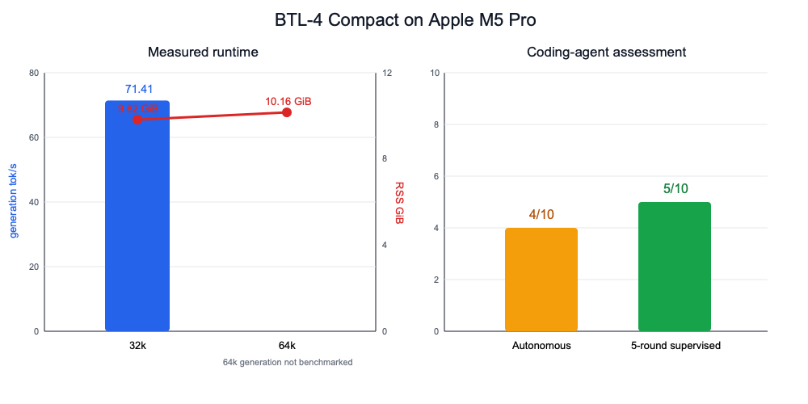

The chart intentionally leaves 64k generation blank because no controlled 64k throughput smoke benchmark was run. Machine-readable measurements are in `results/btl-4-compact-results.json`.

`--jinja` and `--reasoning-format deepseek` are required for this model's tool-call template and reasoning separation. `scripts/run.sh` reads the latter from `REASONING_FORMAT` in the profile.

## Use a model with Pi

[Pi](https://pi.dev) can use the running server through its OpenAI-compatible API.

1. Start the selected model:

   ```bash
   scripts/run.sh qwen3.6-35b-a3b
   ```

2. Merge `config/pi-models.example.json` into `~/.pi/agent/models.json`. Keep any providers already present in that file. Change the model ID, name, and context window when running another profile.

3. Start Pi and select the local model:

   ```bash
   pi --provider local-workbench --model qwen3.6-35b-a3b
   ```

   Alternatively, choose it interactively with `/model`.

The dummy `apiKey` only makes Pi expose the keyless local provider; llama-server does not require it. `qwen-chat-template` lets Pi control Qwen thinking through llama.cpp's chat-template arguments.

## Network access

The server binds to `127.0.0.1` by default. Set `HOST=0.0.0.0` and `EXPOSE_NETWORK=1` in a local config only when remote access is intentional.
