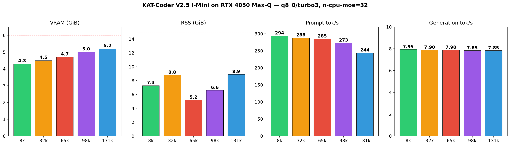
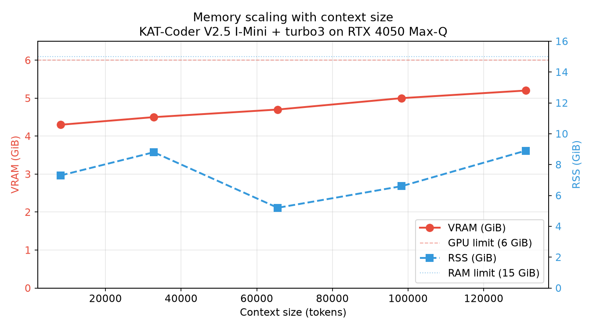
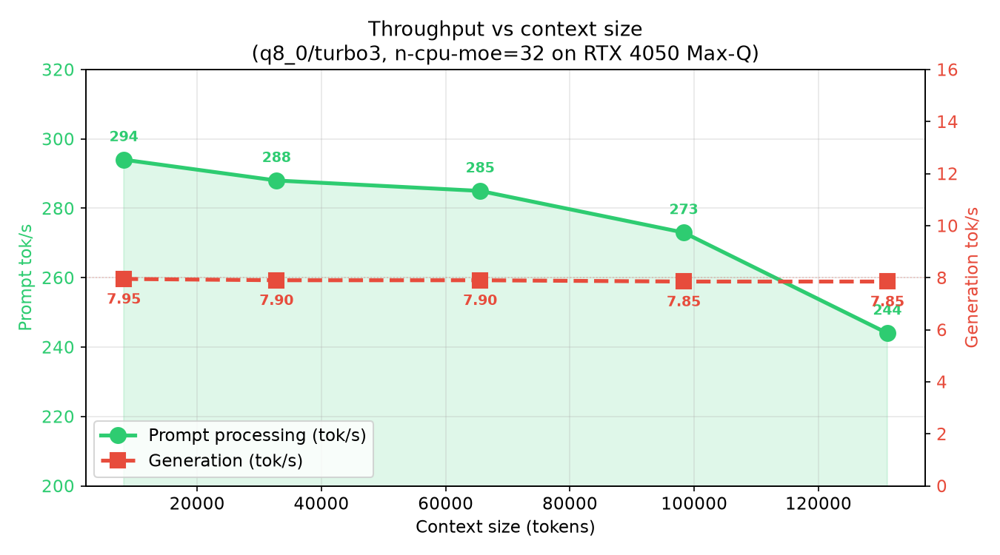
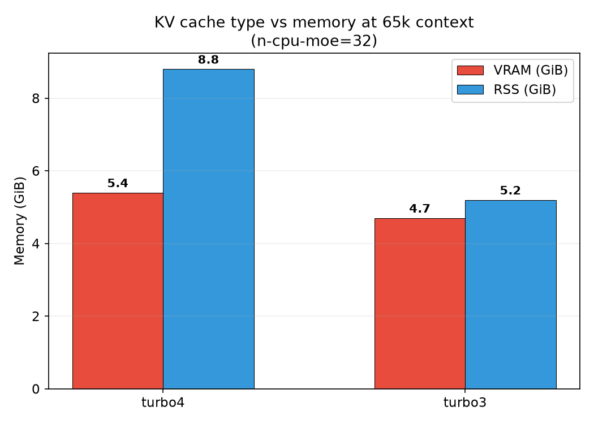

# KAT-Coder TurboQuant runner

This project is a reproducible launcher and tuner for the KAT-Coder V2.5 Dev APEX Mini GGUF on a small GPU. The default model is:

```text
mudler/KAT-Coder-V2.5-Dev-APEX-GGUF
KAT-Coder-V2.5-Dev-APEX-I-Mini.gguf
```

131,072 tokens is the preferred context. A stable 65,536-token configuration is an accepted result.

## Current hardware (verified 2026-07-25)

| Component | Detail |
|---|---|
| CPU | Intel Core i5-13420H, 12 threads |
| RAM | 15 GiB |
| GPU | NVIDIA RTX 4050 Max-Q, 6 GiB VRAM |
| NVIDIA driver | 580.x |
| CUDA | 12.8 |
| OS | Ubuntu 24.04, Linux 6.17 |

## Verified results

The **131,072-token** preferred context is achievable. The winning configuration:

| Parameter | Value |
|---|---|
| Context | 131,072 tokens |
| K cache | q8_0 |
| V cache | turbo3 |
| n-cpu-moe | 32 |
| Batch / Ubatch | 512 / 512 |
| Threads | 8 / 12 batch |
| GPU layers | 99 (full offload request) |

**Memory at 131k:** ~9 GiB RSS, ~5.2 GiB VRAM.

**Throughput at 131k:** ~244 tok/s prompt processing, ~8 tok/s generation (at 8k warm context).

The 65,536-token accepted fallback uses the same settings and fits comfortably (~5.4 GiB RSS, ~4.7 GiB VRAM).

### Performance graphs



**Memory vs context** (q8_0/turbo3, n-cpu-moe=32):



**Throughput vs context:**



**KV cache type comparison at 65k** (turbo3 saves ~0.7 GiB VRAM and ~3.6 GiB RSS vs turbo4):



## Start here

Run diagnostics without downloading anything:

```bash
scripts/preflight.sh --allow-missing-model --allow-missing-runtime --diagnose
```

After the NVIDIA driver is working, build the runtime:

```bash
scripts/build.sh
```

Resolve and download the exact Mini file:

```bash
scripts/download-model.sh --resolve-only
scripts/download-model.sh
```

Run the small baseline/tuner first:

```bash
scripts/autotune.sh --quick
```

Run the full bounded search when the quick search is healthy:

```bash
scripts/autotune.sh
```

Launch the selected configuration:

```bash
scripts/run.sh
scripts/validate.sh --short
scripts/validate.sh --accepted
```

Or run the winning 131k configuration directly:

```bash
# Paths are relative — run from the project root
./.cache/llama-cpp-turboquant/build/bin/llama-server \
  -m ./models/KAT-Coder-V2.5-Dev-APEX-I-Mini.gguf \
  --host 0.0.0.0 --port 8000 \
  --ctx-size 131072 \
  --threads 8 --threads-batch 12 \
  --parallel 1 \
  --cache-type-k q8_0 --cache-type-v turbo3 \
  --ubatch-size 512 --batch-size 512 \
  --n-cpu-moe 32 \
  --seed 42 \
  --reasoning-format deepseek \
  --chat-template-file ./katcoder-chat-template.jinja \
  -ngl 99 -fa on --jinja --metrics
```

> **Tool calling:** do NOT use `--chat-template chatml`. The GGUF's embedded
> template (and the built-in `chatml` preset) is a bare role/content loop with
> no `tools` handling — llama.cpp silently drops all tool definitions, so the
> model never sees them. `katcoder-chat-template.jinja` (in this repo) is the
> official KAT-Coder-V2.5-Dev template from
> [Kwaipilot/KAT-Coder-V2.5-Dev](https://huggingface.co/Kwaipilot/KAT-Coder-V2.5-Dev)
> with full `<tool_call>` support. `--reasoning-format deepseek` splits `<think>`
> blocks out of the reply text.
>
> Verify tool calling:
>
> ```bash
> curl http://127.0.0.1:8000/v1/chat/completions \
>   -H 'Content-Type: application/json' \
>   -d '{"messages":[{"role":"user","content":"weather in Paris?"}],"tools":[{"type":"function","function":{"name":"get_weather","description":"Get weather for a city","parameters":{"type":"object","properties":{"city":{"type":"string"}},"required":["city"]}}}],"max_tokens":200}'
> ```
>
> The response must contain a `tool_calls` array, not plain text.

> **Remote access (e.g., from pi/OpenCode on another machine):**
> The command above already uses `--host 0.0.0.0`, so the server listens on all
> interfaces. Point the client at `http://<laptop-ip>:8000/v1`.
> The laptop IP: `hostname -I | awk '{print $1}'`
> Use `--host 127.0.0.1` instead if the server should only be reachable locally.

Then test:

```bash
curl http://127.0.0.1:8000/v1/chat/completions \
  -H 'Content-Type: application/json' \
  -d '{"messages":[{"role":"user","content":"Hello"}],"max_tokens":32}'
```

Stop only the server started by this project:

```bash
scripts/stop.sh
```

## Configuration

Edit `config/default.env` for paths and limits. The tuner writes the selected parameters to `config/selected.env`; the builder writes the runtime path to `config/runtime.env`; the downloader writes the resolved model path to `config/model.env`.

Generated logs and machine-readable results are under `results/`. The handoff history is [log.md](log.md).

## Tuning behavior

The tuner tests increasing context sizes and asymmetric KV settings, beginning with `q8_0/turbo4`. It only accepts a candidate when the server responds, memory remains within safety margins, and no CUDA/runtime error occurs. It prefers the highest stable context, then throughput. It does not silently enable swap, symmetric aggressive K-cache compression, speculative decoding, or undocumented flags.

Use `--dry-run` to inspect the candidate matrix without launching models. Use `--quick` for the initial smoke search and `--resume` to reuse an existing result directory.

---

Built together using GPT-5.6 — Luna ($2.93), DeepSeek V4 Pro ($0.15) in OpenCode, and Kimi K3 ($1.20).
